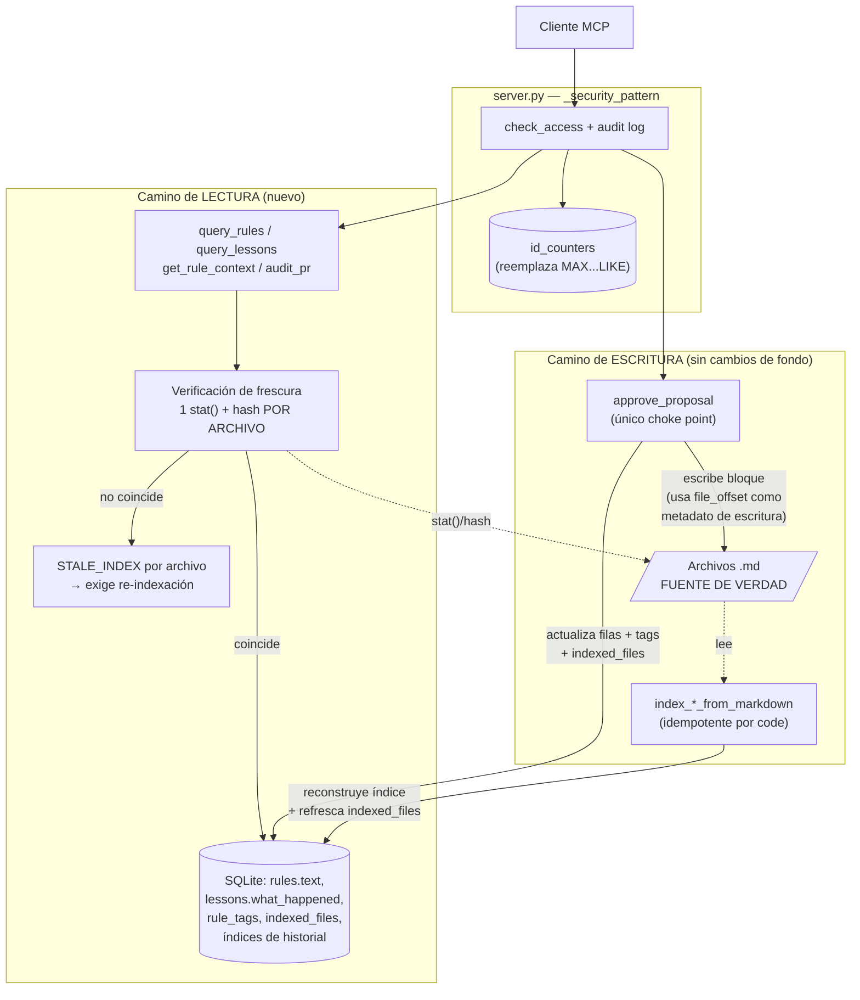

# Decisión Arquitectónica — Degradación de rendimiento proporcional al crecimiento del conocimiento (Axiom Meridian)

**Fecha:** 2026-06-11
**Insumo:** `reporte-rendimiento.md` (rama main · commit a3a2f47)
**Rol:** Arquitecto de software
**Decisión:** Opción C — Lectura servida desde el índice

## 1. Resumen ejecutivo

Recomiendo la **Opción C — Lectura servida desde el índice (SQLite como caché materializada del Markdown, validada por archivo)**, que por definición del propio reporte ya incorpora los puntos ortogonales (1), (2) y (4) de la Opción A. Es la única opción que ataca estructuralmente el mecanismo de degradación que motiva este análisis — el costo proporcional al *volumen de conocimiento* — en lugar de amortiguarlo: convierte `detail="full"` de O(filas × tamaño de archivo) a O(filas), elimina los tres costos sin techo, y lo hace sin introducir cachés en memoria cuya invalidación pueda violar silenciosamente la corrección.

## 2. Análisis del problema

Los síntomas son lentitud creciente en consultas y auditorías. La causa raíz, según la sección 2 del reporte, es que **"la gestión de recursos es por-operación en lugar de por-proceso"**, con cuatro mecanismos compuestos (sección 1): el escaneo `MAX(id) ... LIKE 'al-%'` sobre `access_log` en las 26 tools, el N+1 de `filter_by_attributes`, la relectura del `.md` completo por cada fila en `detail="full"`, y las 14 conexiones efímeras.

Es crucial separar estos mecanismos en dos clases, porque la pregunta de fondo ("entre más reglas se crean, más lento se vuelve") apunta solo a una de ellas:

- **Costos que crecen con los datos** (sin techo): el escaneo de `access_log` (crece con el historial de uso), el N+1 (crece con las reglas candidatas) y la relectura de archivos (crece con reglas × tamaño de `.md`). La sección 2 los resume: "el costo de auditar un PR y el tamaño de la base crecen con el total de conocimiento, no con lo relevante al PR".
- **Costos fijos por operación** (constantes, no crecen): conexiones efímeras, pragmas repetidos, chequeos de filesystem.

El reporte pondera ambos en la misma tabla, pero para el horizonte de 5 años no pesan igual: los primeros determinan si el sistema *sigue siendo usable* con 10.000 reglas; los segundos solo añaden milisegundos constantes. La decisión debe priorizar la clase que degrada.

Un criterio que el reporte menciona pero no pondera suficientemente: la **fragilidad de los offsets posicionales** (sección 3.5: reescribir un bloque "invalida silenciosamente los `file_offset` de todos los bloques posteriores"). Esto no es solo un bug de corrección — es un costo de rendimiento recurrente (re-indexaciones forzadas) y solo la Opción C lo mitiga ("Parcial" en la tabla comparativa; A y B lo dejan en ❌).

## 3. Evaluación de opciones

| Opción | Ataca los costos que crecen con los datos | Ataca costos fijos | Riesgo de corrección | Esfuerzo | Juicio |
|---|---|---|---|---|---|
| **A** — hot paths in-place | Sí, pero la relectura de archivos solo "Parcial (seek + caché por consulta; sigue habiendo I/O por consulta)" (tabla §4) | No | "Nulo" (tabla §4) | 2–3 d | Necesaria pero insuficiente: escalabilidad "Media" a >10.000 reglas |
| **B** — conexión administrada + cachés en memoria | Indirectamente (vía caché, dependiente del hit-rate) | Sí | "Medio": "un camino de escritura que olvide invalidar produce resultados obsoletos (violación silenciosa de ADR-002)" (§4-B) | 5–7 d | Optimiza la clase de costo equivocada para este problema y compra el riesgo más caro: respuestas incorrectas |
| **C** — lectura desde el índice validada por archivo | Sí, estructuralmente: "el costo de `detail=\"full\"` pasa de proporcional al tamaño de los `.md` a proporcional al número de filas devueltas" (§4-C) | Solo lo heredado de A | "Medio", pero verificable en cada consulta (hash/mtime por archivo) | 6–9 d | Única con escalabilidad "Alta" en la tabla; mitiga además la fragilidad de offsets |

Donde el reporte se queda corto: la fila "Riesgo de resultados obsoletos: Medio" trata igual a B y C, pero los riesgos no son equivalentes. En B, un caché en memoria mal invalidado devuelve datos obsoletos **sin ninguna señal** hasta que alguien lo nota. En C, la frescura se verifica **en cada consulta** contra `indexed_files` (un `stat()` + hash), y la desincronización produce un error explícito (`STALE_INDEX`) accionable, no una respuesta incorrecta silenciosa. Para un sistema cuyo producto es *conocimiento institucional confiable*, fallar ruidosamente es categóricamente mejor que responder mal.

## 4. Decisión final y justificación

**Opción C, tal como está especificada en la sección 4 del reporte** — incluyendo explícitamente los componentes heredados de A (tabla de contadores `id_counters`, `filter_by_attributes` con `IN (...)`, índices de historial) que el reporte declara "ortogonales". No adopto los cachés en memoria ni el log diferido de la Opción B.

Evidencia que sustenta la decisión:

1. **Es la única opción que elimina (✅, no "Parcial") la relectura de archivo por fila** según la tabla comparativa de la sección 4, y la única con escalabilidad "Alta (lectura indexada, tags exactos)" a >10.000 reglas. El problema planteado es precisamente ese crecimiento.

2. **Beneficia a los consumidores más pesados.** La sección 3.1 identifica que `audit_pr`/`check_feature_against_rules` tienen "costo e ingesta de disco proporcionales al total de reglas"; la sección 4-C confirma que son "los principales beneficiados".

3. **No viola el invariante de producto.** La sección 3.5 exige que "cualquier optimización de lectura debe poder demostrarse derivada del `.md` y detectar desincronización" — exactamente lo que hace `indexed_files(file_path, mtime, content_hash)`: el Markdown sigue siendo la única fuente de verdad y SQLite sigue siendo un derivado reconstruible (restricción §5); lo que cambia es que la fidelidad se verifica por archivo en vez de releerse por fila. Nota clave de la sección 4-C: las columnas `rules.text` y `lessons.what_happened` **"ya almacenan el texto completo"** — la duplicación ya existe hoy; C no la introduce, la convierte en camino de lectura verificado.

4. **Mejora un problema que A y B no tocan.** La tabla §4 marca "Mitiga la fragilidad de offsets / STALE_INDEX" como ❌ para A y B, "Parcial" para C: "una edición de bloque ya no produce `STALE_INDEX` silencioso por fila sino una señal explícita por archivo, accionable con re-indexación" (§4-C).

5. **El riesgo de corrección es el más auditable de las tres.** Frente al stale-cache de B (que depende de la disciplina de invalidación en memoria, invisible), la frescura de C se materializa en una tabla consultable y se re-verifica en cada lectura.

Sobre el costo fijo por operación que C deja sin resolver (❌ en la tabla): es deliberado. Ese costo es constante — no es el que hace que "entre más reglas, más lento" — y resolverlo con la Opción B exigiría aceptar el debilitamiento del audit trail ("registros en cola se pierden" ante un crash, §4-B), en tensión directa con la restricción inamovible de la sección 5 ("el registro en `access_log` por invocación... no puede eliminarse"). No se justifica en esta decisión.

## 5. Trade-offs explícitos

**Frente a la Opción A (descartada como decisión, absorbida como componente):**
- *Se pierde:* la simplicidad (2–3 días, riesgo "Bajo", "cambios localizados... verificable de forma aislada con la suite existente", §4-A).
- *Por qué es inferior aquí:* deja la relectura de archivos en "Parcial" y la escalabilidad en "Media (I/O de archivo sigue en el camino de lectura)" (tabla §4). Con el horizonte de crecimiento que motiva el reporte, A obliga a reabrir esta misma decisión en cuanto los `.md` crezcan — es la opción barata hoy que hipoteca el camino de lectura mañana. Sus puntos valiosos (contadores, N+1, índices) no se pierden: C los incluye por definición.

**Frente a la Opción B (descartada):**
- *Se pierde:* la reducción del costo fijo por operación (14 conexiones efímeras, pragmas, chequeos de filesystem) y la unificación de las convenciones de conexión (deriva c/d documentada en §3.2).
- *Por qué es inferior aquí:* optimiza costos constantes mientras el problema declarado es de costos crecientes; su mecanismo central (cachés en memoria) introduce el riesgo de "violación silenciosa de ADR-002" (§4-B) en un sistema cuyo valor es la confiabilidad del conocimiento servido; y su log diferido en batch "debilita el audit trail ante un crash" (§4-B) rozando una restricción inamovible (§5). Además exige pruebas de concurrencia HTTP/SSE "que hoy no existen" (§4-B). La unificación de conexiones sigue siendo deseable como saneamiento futuro, pero no forma parte de esta decisión ni la condiciona: es ortogonal y de menor prioridad.

**Costos que esta decisión acepta conscientemente:**
- El mayor esfuerzo de las tres (6–9 días persona, §4-C), incluida la adaptación de la suite de lecturas posicionales (`tests/integration/test_index_and_query.py`).
- Un cambio observable de contrato: `STALE_INDEX` pasa "de granularidad fila a granularidad archivo" (§4-C) — requiere documentación y pruebas de contrato.
- La migración más compleja: "2–3 tablas + backfill" sobre bases instaladas en campo (tabla §4, restricción §5).

## 6. Diagrama Mermaid

Arquitectura objetivo tras aplicar la Opción C:

Límites de responsabilidad: el camino de lectura **nunca** toca el contenido de los `.md` (solo verifica frescura vía `stat()`/hash); el camino de escritura es el único que modifica `.md` e índice, y toda escritura que toque un `.md` debe refrescar `indexed_files` en la misma transacción lógica.

## 7. Autoevaluación de riesgos

Riesgos del diseño propuesto (asumiendo Opción C implementada), con mitigaciones concretas:

**Riesgo 1 — Un camino de escritura olvida refrescar `indexed_files` y el índice sirve texto desactualizado hasta que el hash lo detecte.** El reporte lo identifica: "desincronización silenciosa si un camino de escritura... no refresca `indexed_files`" (§4-C).
*Mitigación:* prohibir escrituras directas a `.md` fuera de un único helper (`write_block(path, ...)`) que escribe el archivo **y** actualiza `indexed_files` atómicamente; los tres escritores actuales (`_append_atomic_block`, el camino `update` de `approve_proposal`, `_mark_deprecated_in_md`) migran a ese helper. Añadir un test de integración que edite un `.md` por fuera del proceso (simulando un editor humano) y verifique que la siguiente consulta devuelve `STALE_INDEX`, no texto viejo.

**Riesgo 2 — La migración con backfill corrompe o pierde datos en bases instaladas en campo** (sembrado de `id_counters` desde los `MAX` existentes, backfill de `rule_tags` desde el JSON de `rules.tags`, hashes iniciales de `indexed_files`). El reporte advierte el caso análogo en §4-A: "si el sembrado inicial calcula mal el máximo existente, se generan IDs duplicados".
*Mitigación:* la migración (a) copia `meridian.db` a `meridian.db.bak-<fecha>` antes de tocar nada, (b) corre dentro de una única transacción con verificación post-migración (conteo de tags backfilled == suma de tags JSON parseados; `id_counters.next > MAX` real de cada tabla) que hace rollback si falla, y (c) se cubre con un test que la ejecuta contra una copia de base poblada con el esquema actual (siguiendo el precedente de la migración 001 citado en §3.5).

**Riesgo 3 — El cambio de granularidad de `STALE_INDEX` (fila → archivo) rompe consumidores MCP existentes** que dependan del comportamiento actual (§4-C: "consumidores existentes del MCP podrían depender del comportamiento actual").
*Mitigación:* conservar la **forma** de la respuesta intacta (el campo `error: "STALE_INDEX"` sigue apareciendo por fila en el payload serializado, cumpliendo ADR-001); lo que cambia es solo cuándo se activa. Fijar esto con un test de contrato en `tests/contract/test_mcp_tool_signatures.py` que valide el shape de la respuesta con y sin staleness, y documentar el cambio de semántica en un ADR-003 enlazado desde el README.

---

**Decisión: Opción C.** El siguiente paso natural es convertir esta decisión en un ADR-003 y planificar la implementación en dos entregas: primero los componentes heredados de A (contadores, N+1, índices — valor inmediato, riesgo bajo), después la lectura indexada con `indexed_files` y la migración con backfill.
