# Guía rápida: probar Axiom Meridian con MCP Inspector

MCP Inspector es una interfaz web para conectarse a un servidor MCP, ver sus tools y ejecutarlas a mano con los parámetros que quieras. Sirve para comprobar que Meridian responde bien sin pasar por Claude Code u OpenCode.

Todas las capturas de esta guía son de tu Inspector local (v2.8.0) conectado a Meridian, con tu base de conocimiento real.

---

## 1. Levantar Inspector y conectar el servidor

Inspector no se instala en el proyecto: se lanza con `npx`, que descarga el paquete la primera vez. Los únicos requisitos son Node.js y el venv de Meridian.

Syntax: `npx @modelcontextprotocol/inspector [opciones de Inspector] <comando del servidor> [args del servidor]`. Las variables de entorno del servidor se pasan con `-e NOMBRE=valor`; el resto de opciones son las de `--config` (sección 4).

### 1.1 Comando base

```bash
npx @modelcontextprotocol/inspector \
  ~/.meridian/venv/bin/python -m meridian mcp
```

Ese es el arranque que usa esta guía: la instalación de `~/.meridian/venv` en el nivel `analyze` (que es el nivel por defecto, así que no hace falta pasar `-e MERIDIAN_ACCESS_LEVEL`). Para probarlo con las tools de escritura, añade las variables de la sección 4:

```bash
npx @modelcontextprotocol/inspector \
  -e MERIDIAN_ACCESS_LEVEL=write \
  -e KNOWLEDGE_BASE_PATH=/tmp/meridian-pruebas \
  ~/.meridian/venv/bin/python -m meridian mcp
```

### 1.2 Probar el código de esta carpeta

El comando anterior lanza la instalación global, no el código del repositorio. Para probar tus cambios sin instalar nada, apunta al venv del proyecto (`.venv/bin/meridian` es el entry point que registra `uv pip install -e .`):

```bash
npx @modelcontextprotocol/inspector \
  .venv/bin/meridian mcp
```

Si ese binario no existe, ejecútalo desde la raíz del repo:

```bash
uv pip install -e .
```

Alternativa equivalente, sin entry point:

```bash
npx @modelcontextprotocol/inspector \
  .venv/bin/python -m meridian mcp
```

### 1.3 Instalarlo de forma permanente

Si vas a usar Inspector a menudo, instálalo global y ejecuta `mcp-inspector` sin `npx` (mismo resultado, arranque más rápido):

```bash
npm install -g @modelcontextprotocol/inspector
mcp-inspector ~/.meridian/venv/bin/python -m meridian mcp
```

Para actualizarlo: `npm update -g @modelcontextprotocol/inspector`.

### 1.4 Abrir la interfaz y conectar

Inspector se abre en `http://127.0.0.1:6274/?MCP_INSPECTOR_API_TOKEN=...`. El token cambia en cada arranque; usa la URL que imprime la terminal al lanzarlo.

En la pestaña **Servers** verás el servidor configurado. Si aparece **Disconnected**, pulsa el interruptor de la derecha.

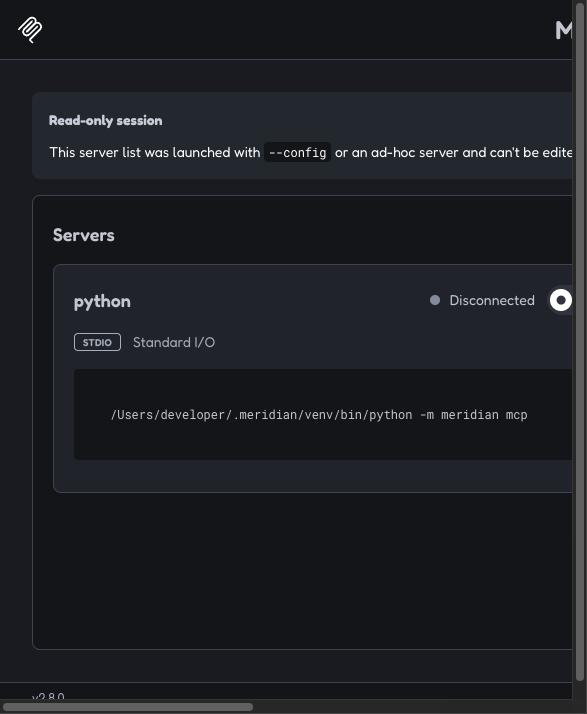

Cuando conecta, el indicador pasa a verde (**Connected**) y arriba aparece el nombre `meridian`.

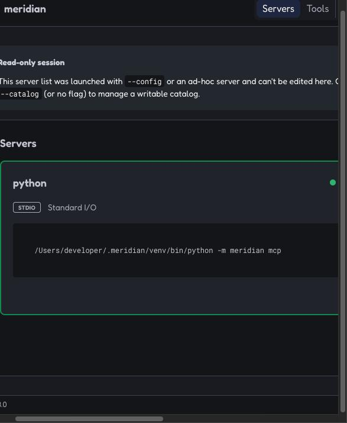

> Si al conectar aparece **failed**, vuelve a intentarlo. El primer arranque puede tardar porque Meridian carga `torch` y `sentence-transformers`. Si sigue fallando, abre la pestaña **Logs** del panel derecho y revisa el error.

## 2. Ver y ejecutar una tool

Ve a la pestaña **Tools**. A la izquierda está la lista de las 26 tools; al elegir una, en el centro aparecen sus parámetros (los marcados con `*` son obligatorios) y el botón **Execute Tool**.

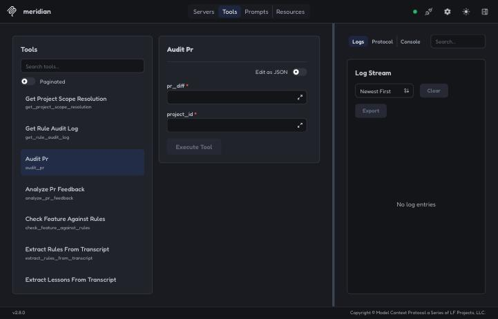

El resultado aparece en el panel **Results**. Pulsa la **X** para volver al formulario.

Cada tool muestra su descripción (qué hace, nivel de acceso requerido y qué devuelve) y cada parámetro tiene su propia descripción con los valores válidos — verificado conectando un cliente MCP real por stdio contra `~/.meridian/venv` y comparando la respuesta `tools/list` con lo esperado (las 26 tools, sin ninguna ni ningún parámetro sin documentar). Cubierto también por `tests/contract/test_mcp_tool_signatures.py::test_every_tool_and_parameter_is_documented`.

---

## 3. Ejemplos probados

Los ejemplos van de menor a mayor impacto: los de **lectura** no modifican nada; los de **análisis** crean un registro de auditoría; los de **escritura** están bloqueados por defecto (ver sección 4).

### 3.1 `get_rule_template` · lectura

Devuelve la plantilla del formato atómico de una regla y la descripción de cada campo. No necesita parámetros: deja `project_id` vacío y ejecuta.

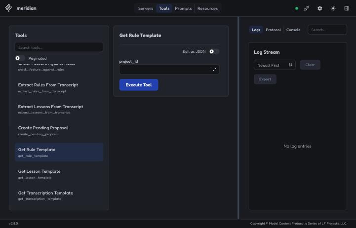

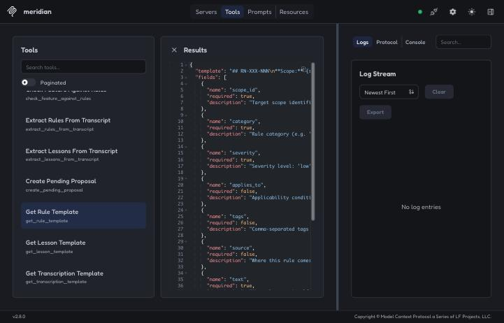

Variantes: `get_lesson_template` y `get_transcription_template` funcionan igual.

### 3.2 `get_project_scope_resolution` · lectura

Muestra la cadena de scopes efectiva de un proyecto, del más específico al más general, con sus atributos.

| Parámetro | Valor |
|---|---|
| `project_id` | `axiom-meridian` |

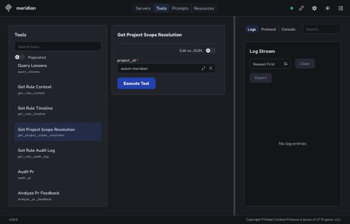

Resultado esperado: `project-axiom-meridian` → `global-fastmcp` → `global-python` → `global`.

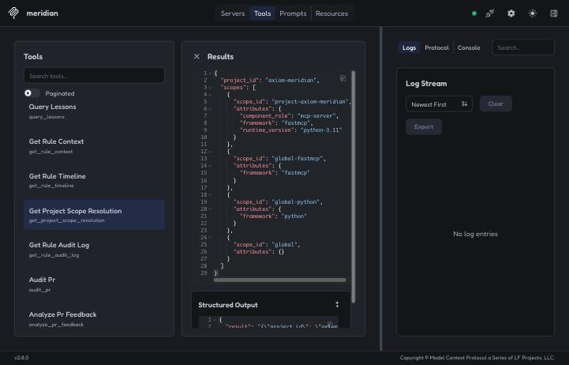

Prueba también con `project-example` (hereda de Quarkus/Java) o `ledger` (Flutter).

### 3.3 `query_rules` · lectura

Lista las reglas activas que aplican a un proyecto, incluyendo las heredadas de sus scopes.

| Parámetro | Valor | Notas |
|---|---|---|
| `project_id` | `axiom-meridian` | obligatorio |
| `severity` | `critical` | opcional: `low`, `medium`, `high`, `critical` |
| `category` | `general` | opcional |
| `format` | `json` | cambia a `toon` para ver la salida compacta del ADR-001 |
| `detail` | `summary` | usa `full` para incluir el texto de cada regla |

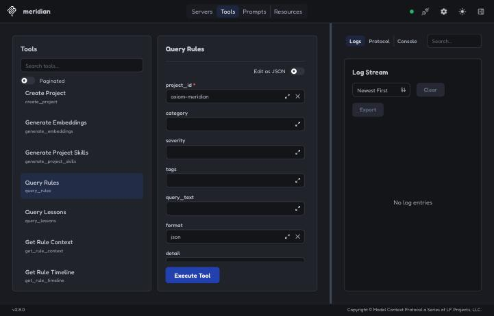

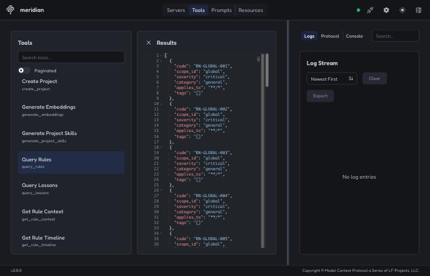

Variante: `query_lessons` con `project_id` y opcionalmente `area`.

### 3.4 `get_rule_context` · lectura

Trae una regla completa: su texto, su historial de cambios y las lecciones vinculadas. Toma un `code` de la salida de `query_rules`.

| Parámetro | Valor |
|---|---|
| `rule_id` | `RN-GLOBAL-001` |

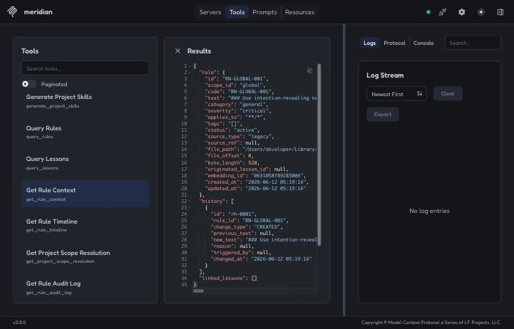

Variante más ligera: `get_rule_timeline` con el mismo `rule_id`, que devuelve solo el historial.

### 3.5 `audit_pr` · análisis

Reúne las reglas y lecciones que aplican a un diff y le devuelve al agente la instrucción para auditarlo. Meridian **no** emite el veredicto: lo hace el LLM cliente con ese contexto. Cada ejecución crea un registro (`audit-000N`).

| Parámetro | Valor |
|---|---|
| `pr_diff` | ver abajo |
| `project_id` | `axiom-meridian` |

Diff de ejemplo (nombres poco descriptivos y excepción silenciada):

```diff
+ def calc(d):
+     try:
+         return d * 2
+     except Exception:
+         pass
```

> **Ojo con los saltos de línea:** el campo de texto simple los elimina (en la captura el diff quedó en una sola línea). Para textos multilínea usa el botón **↗** para expandir el campo, o activa **Edit as JSON** y escribe `\n` en el valor.

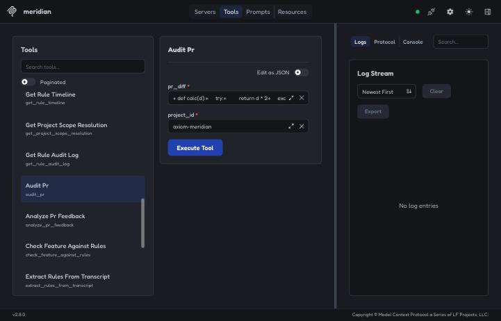

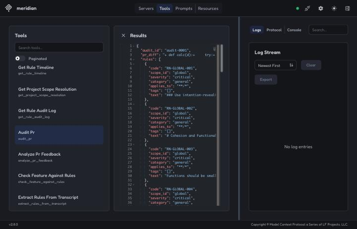

Tools similares:
- `check_feature_against_rules`: `feature_description` = `Nuevo endpoint que expone datos de clientes y captura excepciones genéricas`, `project_id` = `axiom-meridian`.
- `create_pending_proposal`: `type` = `rule`, `proposed_text` = `Todo endpoint debe validar su entrada.`, `suggested_scope_id` = `project-axiom-meridian`. Devuelve un `prop-000N`, que luego ves con `list_pending_proposals`.

---

## 4. Niveles de acceso

Meridian limita las tools según la variable `MERIDIAN_ACCESS_LEVEL`. Tu Inspector la lanza sin esa variable, así que usa el nivel por defecto, `analyze`.

| Nivel | Qué permite |
|---|---|
| `read` | consultas y plantillas (`query_*`, `get_*`, `list_pending_proposals`) |
| `analyze` *(por defecto)* | lo anterior + `audit_pr`, `check_feature_against_rules`, `extract_*`, `create_pending_proposal` |
| `write` | todo, incluidas `index_*`, `approve_proposal`, `promote_rule`, `generate_embeddings`… |

Si ejecutas una tool de escritura con `analyze`, la respuesta es `ACCESS_DENIED` y no se modifica nada. En esta prueba se usó `index_rules_from_markdown` con un archivo inexistente, para ver el bloqueo sin riesgo:

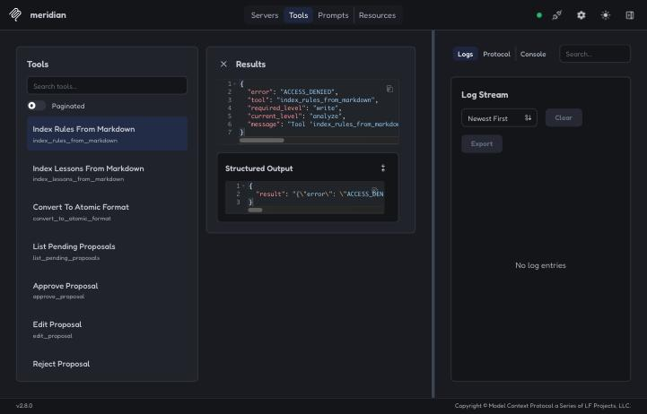

Para probar las tools de escritura, lanza Inspector pasando la variable con `-e`:

```bash
npx @modelcontextprotocol/inspector \
  -e MERIDIAN_ACCESS_LEVEL=write \
  /Users/developer/.meridian/venv/bin/python -m meridian mcp
```

O con un archivo de configuración (`--config`), por ejemplo `inspector.json`:

```json
{
  "mcpServers": {
    "meridian": {
      "command": "/Users/developer/.meridian/venv/bin/python",
      "args": ["-m", "meridian", "mcp"],
      "env": { "MERIDIAN_ACCESS_LEVEL": "write" }
    }
  }
}
```

```bash
npx @modelcontextprotocol/inspector --config inspector.json --server meridian
```

> Con `write`, las tools escriben en tu base real (`~/Library/Application Support/meridian`). Para experimentar sin tocarla, añade `-e KNOWLEDGE_BASE_PATH=/tmp/meridian-pruebas` (o `"KNOWLEDGE_BASE_PATH"` en `env`) y Meridian creará una base vacía en esa ruta.

---

## 5. Problemas comunes

| Síntoma | Causa probable | Qué hacer |
|---|---|---|
| **failed** al conectar | arranque lento o error al iniciar | reintentar; revisar **Logs** |
| `ACCESS_DENIED` | nivel de acceso insuficiente | lanzar con `MERIDIAN_ACCESS_LEVEL=write` (sección 4) |
| El diff llega en una sola línea | el campo simple elimina los saltos de línea | usar **↗** o **Edit as JSON** |
| El servidor ejecuta otra versión | Inspector lanza `~/.meridian/venv`, no el código de esta carpeta | reinstalar o apuntar al `.venv` del proyecto |
