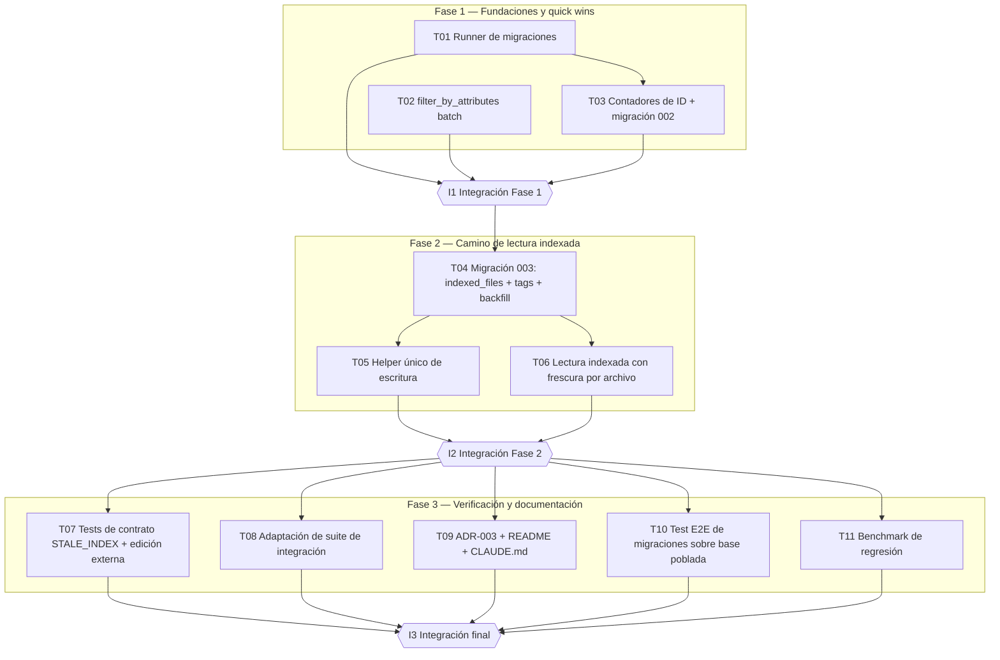

# Plan de Implementación – Axiom Meridian: Lectura servida desde el índice (Opción C, archy-rendimiento.md)

**Fecha:** 2026-06-11 · **Base:** main · a3a2f47 · **Insumos:** `archy-rendimiento.md` (decisión), `reporte-rendimiento.md` (evidencia)

## Resumen Ejecutivo

- **Estrategia de implementación:** ejecutar la Opción C en tres fases alineadas con las "dos entregas" de la decisión arquitectónica, más una fase de verificación. Fase 1: infraestructura de migraciones (hoy inexistente: `001_lessons_columns.sql` no es aplicada por ningún código) y componentes heredados de la Opción A (contadores de ID, fix del N+1, índices). Fase 2: el camino de lectura indexada — tablas `indexed_files`/`rule_tags`/`lesson_tags`, helper único de escritura y lectura desde SQLite con verificación de frescura por archivo. Fase 3: pruebas de contrato, adaptación de la suite, prueba E2E de migraciones, benchmark de regresión y documentación (ADR-003).
- **Riesgos principales:** los tres autoevaluados por el arquitecto (§7 de archy-rendimiento.md) — desincronización de `indexed_files` (cubierto por T05 + validación en I2), corrupción en migración sobre bases en campo (cubierto por T01 + T10), ruptura del contrato `STALE_INDEX` (cubierto por T06 + T07) — más un riesgo operativo detectado al leer el código: no existe mecanismo de aplicación de migraciones, por lo que T01 lo crea antes que nada.
- **Hitos:** I1 (quick wins integrados, migración 002 aplicable), I2 (camino de lectura indexada convergente: escritura→lectura fresca y edición externa→`STALE_INDEX`), I3 (suite completa verde, contrato validado, documentación publicada).
- **Duración estimada:** 6 días hábiles (camino crítico de 5 misiones: T01→T03→T04→T06→T08, 40 h + overhead de hitos).
- **Nivel de paralelización:** 91 % (10 de 11 misiones pueden ejecutarse concurrentemente con al menos otra misión de su fase).

## Métricas Globales

```yaml
total_missions: 11
parallel_missions: 10
blocked_missions: 9
critical_path_length: 5
estimated_duration_days: 6
parallelization_score: 91
```

## Mapa de Dependencias



Nota de lectura del DAG: las aristas misión→misión corresponden a `depends_on`; los nodos I1/I2/I3 son compuertas de fase — ninguna misión de la fase N+1 arranca antes de que el hito de la fase N pase. Los `depends_on` entre fases (p. ej. T07 → T05, T06; T10 → T03, T04) quedan cubiertos por la compuerta I2.

## Hitos de Integración

### I1 — Quick wins integrados y migraciones operativas

- **Misiones que cierra:** T01, T02, T03.
- **Validaciones:**
  - `uv run pytest` completo en verde sobre la rama integrada.
  - `uv run ruff check src tests` sin errores.
  - Sobre una copia de base con datos (fixture poblada con reglas/lecciones/proposals/access_log): aplicar el runner → migración 002 aplicada exactamente una vez, re-ejecución es no-op, y `id_counters.next > MAX` numérico real de cada tabla/prefijo sembrado.
  - `EXPLAIN QUERY PLAN` de las consultas de `get_rule_timeline`/`get_rule_audit_log` usa los índices nuevos (`idx_rule_history_rule_id`, `idx_lesson_history_lesson_id`).
- **Criterio de paso:** los IDs generados tras la migración no colisionan con los existentes (test automático que crea N registros nuevos en cada tabla) y ningún tool MCP ejecuta ya `SELECT MAX(...) LIKE` (grep en `src/` retorna 0 ocurrencias fuera del script de sembrado de la migración).

### I2 — Camino de lectura indexada convergente

- **Misiones que cierra:** T04, T05, T06.
- **Validaciones:**
  - `uv run pytest` completo en verde.
  - Test cruzado escritura→lectura: `approve_proposal` de una regla nueva seguido de `query_rules(detail="full")` devuelve el texto correcto **sin** releer el `.md` por fila (verificable porque el contenido proviene de `rules.text` y la consulta solo hace `stat()` del archivo — instrumentable con un spy/monkeypatch sobre `Path.read_bytes` que falla si se invoca en el camino de lectura).
  - Test cruzado de frescura: editar el `.md` por fuera del proceso → la siguiente consulta `detail="full"` devuelve `error: "STALE_INDEX"` en las filas de ese archivo, nunca texto obsoleto.
  - Contrato de tablas: toda escritura de T05 (`approve_proposal` append y update, `_mark_deprecated_in_md`, `index_*`) deja `indexed_files.content_hash` == hash real del archivo resultante.
- **Criterio de paso:** las dos validaciones cruzadas pasan y `grep -rn "read_bytes()" src/meridian/tools/knowledge_consumption.py` retorna 0 ocurrencias.

### I3 — Entrega verificada y documentada

- **Misiones que cierra:** T07, T08, T09, T10, T11.
- **Validaciones:**
  - `uv run pytest` (unit + integration + contract) en verde, incluyendo los tests nuevos de T07/T08/T10/T11.
  - El benchmark de T11 demuestra que el costo de `query_rules(detail="full")` no escala con el tamaño del `.md` (criterio numérico definido en T11).
  - `ADR-003` existe en la raíz, enlazado desde README, y CLAUDE.md refleja la nueva semántica de lectura.
- **Criterio de paso:** todos los criterios de aceptación de las 11 misiones marcados como cumplidos por sus validadores; ningún reporte de subagente con `confidence_score < 70` sin revisión documentada.

## Misiones

### T01 – Runner de migraciones con backup y rollback

```yaml
mission_id: T01
mission_name: Runner de migraciones con backup y rollback
phase: 1
objective: Crear el mecanismo de aplicación de migraciones SQL que hoy no existe (001_lessons_columns.sql no es referenciada por ningún código), con backup previo, transacción única y registro de versión, para que las migraciones 002 y 003 puedan desplegarse sobre bases en campo.
criticality: CRITICAL
required_talents:
  - backend-senior
  - database
required_context:
  - archy-rendimiento.md (sección 7, Riesgo 2)
  - src/meridian/db/connection.py
  - src/meridian/db/migrations/001_lessons_columns.sql
  - src/meridian/config.py (get_db_path)
depends_on: []
shared_resources:
  - src/meridian/db/connection.py
conflict_risk: LOW
target_components:
  - src/meridian/db/migrations.py (nuevo)
  - src/meridian/db/connection.py (initialize_db invoca el runner)
  - tests/unit/test_migrations.py (nuevo)
implementation_steps:
  - "1. Crear src/meridian/db/migrations.py: descubre archivos NNN_*.sql en db/migrations/ ordenados por prefijo numérico y aplica los pendientes según PRAGMA user_version (user_version == último NNN aplicado)."
  - "2. Antes de aplicar migraciones pendientes, copiar meridian.db a meridian.db.bak-<YYYYMMDD-HHMMSS> en el mismo directorio."
  - "3. Aplicar cada migración dentro de una transacción; ante excepción: rollback, restaurar mensaje con la ruta del backup y abortar (no aplicar las siguientes)."
  - "4. Caso especial 001: detectar con PRAGMA table_info(lessons) si las columnas source_type/source_ref/created_at/updated_at ya existen; si existen, marcar 001 como aplicada sin ejecutarla (las bases en campo ya las tienen)."
  - "5. Integrar el runner en initialize_db (db/connection.py) después de la creación del esquema, de modo que python -m meridian db init y el arranque del servidor apliquen migraciones pendientes."
  - "6. Escribir tests/unit/test_migrations.py: aplica sobre base nueva (no-op), sobre base vieja sin columnas (aplica 001), re-ejecución idempotente, fallo a mitad de migración deja la base intacta y el backup presente."
deliverables:
  - src/meridian/db/migrations.py funcional e integrado en initialize_db
  - tests/unit/test_migrations.py
acceptance_criteria:
  - "uv run pytest tests/unit/test_migrations.py pasa"
  - "Tras aplicar el runner dos veces sobre la misma base, PRAGMA user_version no cambia en la segunda ejecución y no se crea segundo backup"
  - "Un test simula migración fallida (SQL inválido) y verifica que la base queda con user_version anterior y existe el archivo meridian.db.bak-*"
  - "uv run pytest (suite completa) sigue en verde"
estimated_hours: 6
parallelizable: true
responsible: Agent-T01
validator: QA-Agent
approver: TechLead
```

### T02 – filter_by_attributes en una sola consulta (fix N+1)

```yaml
mission_id: T02
mission_name: filter_by_attributes en una sola consulta (fix N+1)
phase: 1
objective: Eliminar el patrón N+1 documentado en reporte-rendimiento.md sección 3.2 reescribiendo filter_by_attributes como una única consulta WHERE rule_id IN (...) agrupada en Python, preservando exactamente la semántica de inclusión conservadora de ADR-002.
criticality: HIGH
required_talents:
  - backend-senior
required_context:
  - reporte-rendimiento.md (sección 3.2, fragmento N+1)
  - ADR-002-dynamic-context-attributes.md
  - src/meridian/utils/scope_resolver.py
  - tests/unit/test_scope_resolver.py
depends_on: []
shared_resources: []
conflict_risk: LOW
target_components:
  - src/meridian/utils/scope_resolver.py (filter_by_attributes)
  - tests/unit/test_scope_resolver.py
implementation_steps:
  - "1. Reescribir filter_by_attributes: una sola query 'SELECT rule_id, key, value FROM rule_attributes WHERE rule_id IN (...)' con placeholders dinámicos, agrupando filas por rule_id en un dict."
  - "2. Aplicar en memoria la lógica ADR-002 sin cambios semánticos: sin atributos → incluir; key ausente en project_attributes → incluir; key presente con valor distinto → excluir."
  - "3. Trocear la lista de rule_ids en lotes de 500 para respetar el límite de variables de SQLite (SQLITE_MAX_VARIABLE_NUMBER)."
  - "4. Preservar el orden de entrada de rule_ids en la salida (el orden actual proviene del orden de iteración; verificar contra los tests existentes)."
  - "5. Ampliar tests/unit/test_scope_resolver.py con un caso de >500 rule_ids y un caso que cuente queries ejecutadas (cursor spy) verificando que sea exactamente ceil(n/500)."
deliverables:
  - filter_by_attributes reescrito con paridad semántica ADR-002
  - Tests unitarios ampliados (lotes y conteo de queries)
acceptance_criteria:
  - "uv run pytest tests/unit/test_scope_resolver.py pasa"
  - "Un test verifica con un spy que filtrar 1000 rule_ids ejecuta como máximo 2 consultas SQL (no 1000)"
  - "uv run pytest tests/integration en verde (query_rules no cambia resultados observables)"
estimated_hours: 4
parallelizable: true
responsible: Agent-T02
validator: QA-Agent
approver: TechLead
```

### T03 – Contadores de ID: migración 002 + reescritura de id_generator

```yaml
mission_id: T03
mission_name: Contadores de ID (migración 002 + id_generator.py)
phase: 1
objective: Eliminar los escaneos MAX(...) LIKE del camino crítico de las 26 tools reemplazándolos por la tabla id_counters con actualización atómica, sembrada desde los máximos reales existentes, conservando los formatos externos RN-{TECH}-NNN / LL-{TECH}-NNN y prefix-NNNN.
criticality: CRITICAL
required_talents:
  - backend-senior
  - database
required_context:
  - reporte-rendimiento.md (sección 4, Opción A punto 1; sección 3.3 padding de IDs)
  - archy-rendimiento.md (sección 7, Riesgo 2)
  - src/meridian/utils/id_generator.py
  - src/meridian/db/schema.sql
  - tests/unit/test_id_generator.py
depends_on:
  - T01
shared_resources:
  - src/meridian/db/schema.sql
conflict_risk: MEDIUM
target_components:
  - src/meridian/db/migrations/002_id_counters.sql (nuevo)
  - src/meridian/db/schema.sql (tabla id_counters + 4 índices)
  - src/meridian/utils/id_generator.py (3 funciones)
  - tests/unit/test_id_generator.py
implementation_steps:
  - "1. Añadir a schema.sql (instalaciones nuevas) y a migrations/002_id_counters.sql (bases en campo): CREATE TABLE id_counters (name TEXT PRIMARY KEY, next INTEGER NOT NULL); CREATE INDEX idx_rule_history_rule_id ON rule_history(rule_id); idx_lesson_history_lesson_id ON lesson_history(lesson_id); idx_pending_proposals_scope_id ON pending_proposals(scope_id); idx_pr_audits_ref_project ON pr_audits(pr_ref, project_id)."
  - "2. En la migración 002, sembrar id_counters extrayendo el máximo NUMÉRICO real por prefijo: parsear el sufijo con CAST del último segmento a entero (no MAX lexicográfico, que se corrompe a partir de 1000/10000 según reporte sección 3.3); cubrir tablas access_log (al), pending_proposals (prop), rule_history (rh), lesson_history (lh), pr_audits (audit), planning_checks (check) y los códigos RN-*/LL-* por segmento TECH presentes en rules.code/lessons.code."
  - "3. Reescribir next_sequential_id, next_rule_code y next_lesson_code en id_generator.py para usar UPDATE id_counters SET next = next + 1 WHERE name = ? RETURNING next, con INSERT INTO id_counters ... ON CONFLICT como inicialización perezosa del contador ausente; conservar formatos de salida exactos (RN-{TECH}-NNN con padding 3, prefix-NNNN con padding 4, permitiendo desbordar el padding sin romper: 1000 → 'RN-X-1000')."
  - "4. Mantener las firmas públicas de las 3 funciones (conn, scope_id/table, prefix) para no tocar los 15 sitios de llamada."
  - "5. Actualizar tests/unit/test_id_generator.py: secuencia correcta tras sembrado, contador nuevo arranca en 001/0001, desborde de padding genera IDs únicos y crecientes, y dos generaciones consecutivas nunca repiten ID."
deliverables:
  - migrations/002_id_counters.sql con sembrado verificado
  - id_generator.py sin ningún MAX(...) LIKE
  - schema.sql actualizado (tabla + 4 índices)
  - Tests unitarios actualizados
acceptance_criteria:
  - "uv run pytest tests/unit/test_id_generator.py pasa"
  - "grep -rn 'LIKE' src/meridian/utils/id_generator.py retorna 0 ocurrencias"
  - "Test de migración: sobre una base poblada con access_log al-0001..al-1200 (cruza el límite de padding 4), el sembrado fija next=1201 y el siguiente ID es al-1201 sin colisión"
  - "uv run pytest (suite completa) en verde"
estimated_hours: 8
parallelizable: true
responsible: Agent-T03
validator: QA-Agent
approver: TechLead
```

### T04 – Migración 003: indexed_files, rule_tags/lesson_tags y backfill

```yaml
mission_id: T04
mission_name: Migración 003 (indexed_files + tags normalizados + backfill)
phase: 2
objective: Crear las tablas del camino de lectura indexada — indexed_files(file_path, mtime, content_hash) y rule_tags/lesson_tags — con backfill verificado desde los datos existentes (JSON de rules.tags/lessons.tags y hash real de cada .md indexado).
criticality: CRITICAL
required_talents:
  - database
  - backend-senior
required_context:
  - archy-rendimiento.md (secciones 4, 6 y 7-Riesgo 2)
  - reporte-rendimiento.md (sección 4, Opción C)
  - src/meridian/db/schema.sql
  - src/meridian/db/migrations.py (runner de T01)
depends_on:
  - T01
  - T03
shared_resources:
  - src/meridian/db/schema.sql
conflict_risk: MEDIUM
target_components:
  - src/meridian/db/migrations/003_read_index.sql (nuevo; si el backfill de hashes exige Python, complementar con paso programático registrado en migrations.py)
  - src/meridian/db/schema.sql
  - tests/unit/test_migrations.py (casos de 003)
implementation_steps:
  - "1. Definir en schema.sql y en la migración 003: CREATE TABLE indexed_files (file_path TEXT PRIMARY KEY, mtime REAL NOT NULL, content_hash TEXT NOT NULL, updated_at TEXT DEFAULT (datetime('now'))); CREATE TABLE rule_tags (rule_id TEXT NOT NULL REFERENCES rules(id) ON DELETE CASCADE, tag TEXT NOT NULL, PRIMARY KEY (rule_id, tag)); CREATE TABLE lesson_tags (igual para lessons); CREATE INDEX idx_rule_tags_tag ON rule_tags(tag); idx_lesson_tags_tag ON lesson_tags(tag)."
  - "2. Backfill de tags: por cada fila de rules/lessons con tags JSON no vacío, parsear el array e insertar (id, tag) normalizado (strip, sin vacíos); conservar la columna tags existente como dato legado de solo lectura (no se elimina en esta entrega)."
  - "3. Backfill de indexed_files: por cada file_path distinto en rules y lessons cuyo archivo exista, calcular sha256 del contenido y registrar (file_path, mtime, hash); archivos referenciados pero inexistentes NO se insertan (las consultas devolverán STALE_INDEX para ellos, comportamiento equivalente al actual de path.exists())."
  - "4. Verificación post-migración dentro de la misma transacción: COUNT(rule_tags) == suma de longitudes de los arrays JSON parseados; COUNT(indexed_files) == número de file_path distintos existentes en disco; si alguna verificación falla → rollback (el runner de T01 ya garantiza backup y aborto)."
  - "5. Añadir a tests/unit/test_migrations.py: base poblada con tags JSON variados (lista vacía, null, con espacios) migra con conteos exactos; re-ejecución no duplica filas."
deliverables:
  - migrations/003_read_index.sql (+ paso programático si aplica)
  - schema.sql con las 3 tablas y 2 índices nuevos
  - Tests de migración 003
acceptance_criteria:
  - "uv run pytest tests/unit/test_migrations.py pasa incluyendo los casos de 003"
  - "Tras migrar una base de fixture con 3 reglas (tags: ['a','b'], [], null), SELECT COUNT(*) FROM rule_tags retorna 2"
  - "Tras migrar, todo file_path de rules con archivo presente tiene fila en indexed_files cuyo content_hash coincide con sha256 del archivo (test automático)"
  - "uv run pytest (suite completa) en verde"
estimated_hours: 8
parallelizable: false
responsible: Agent-T04
validator: QA-Agent
approver: TechLead
```

### T05 – Helper único de escritura y mantenimiento del índice

```yaml
mission_id: T05
mission_name: Helper único de escritura (write_block) y mantenimiento de indexed_files/tags
phase: 2
objective: Implementar la mitigación del Riesgo 1 del arquitecto - prohibir escrituras directas a .md fuera de un único helper que escribe el archivo y actualiza indexed_files atómicamente - y mantener rule_tags/lesson_tags en todos los caminos de escritura.
criticality: CRITICAL
required_talents:
  - backend-senior
required_context:
  - archy-rendimiento.md (secciones 6 y 7-Riesgo 1)
  - src/meridian/tools/knowledge_management.py (_append_atomic_block, approve_proposal, _mark_deprecated_in_md, index_rules_from_markdown, index_lessons_from_markdown)
  - CLAUDE.md (invariantes: proposal lifecycle, privacy, positional reads)
depends_on:
  - T04
shared_resources:
  - contrato de indexed_files (compartido con T06)
conflict_risk: MEDIUM
target_components:
  - src/meridian/tools/knowledge_management.py
implementation_steps:
  - "1. Crear en knowledge_management.py el helper write_block(conn, dest_path, new_bytes_or_append) que: escribe el archivo, recalcula mtime y sha256 del contenido resultante y hace UPSERT en indexed_files — todo invocado dentro de la transacción SQLite del caso de uso llamador (escritura de archivo primero, UPSERT después, commit del llamador al final, igual que el orden actual de approve_proposal)."
  - "2. Migrar los tres escritores actuales al helper: _append_atomic_block (camino append de approve_proposal), el camino update de approve_proposal (reemplazo por slice de bytes) y _mark_deprecated_in_md (promote_rule)."
  - "3. En approve_proposal (tipos rule/lesson y update): además de la fila en rules/lessons, sincronizar rule_tags/lesson_tags (DELETE + INSERT del set normalizado con _normalize_tags)."
  - "4. En index_rules_from_markdown e index_lessons_from_markdown: al finalizar el indexado de un archivo, refrescar su fila de indexed_files (es el mecanismo de recuperación ante STALE_INDEX) y sincronizar las tablas de tags de cada regla/lección creada o actualizada."
  - "5. Verificar con grep que ningún open('ab')/write_bytes sobre .md de conocimiento queda fuera del helper en knowledge_management.py."
deliverables:
  - write_block implementado y adoptado por los 3 escritores + 2 indexadores
  - Sincronización de rule_tags/lesson_tags en todos los caminos de escritura
acceptance_criteria:
  - "uv run pytest tests/integration/test_proposals_flow.py pasa"
  - "Test nuevo: tras approve_proposal, indexed_files.content_hash == sha256 real del .md modificado y rule_tags contiene exactamente los tags de la metadata"
  - "Test nuevo: tras promote_rule (_mark_deprecated_in_md), indexed_files del archivo afectado queda actualizado (hash coincide)"
  - "grep -n 'write_bytes\\|open(\"ab\")' src/meridian/tools/knowledge_management.py solo aparece dentro de write_block"
estimated_hours: 10
parallelizable: true
responsible: Agent-T05
validator: QA-Agent
approver: TechLead
```

### T06 – Camino de lectura indexada con frescura por archivo

```yaml
mission_id: T06
mission_name: Lectura desde SQLite con verificación de frescura por archivo
phase: 2
objective: Servir detail="full" y get_rule_context desde rules.text/lessons.what_happened con UNA verificación stat()+hash por archivo por consulta (no un read_bytes por fila), preservando la forma exacta de la respuesta (error STALE_INDEX por fila, ADR-001) y reemplazando los filtros de tags LIKE '%...%' por joins a rule_tags/lesson_tags.
criticality: CRITICAL
required_talents:
  - backend-senior
required_context:
  - archy-rendimiento.md (secciones 4, 6 y 7-Riesgo 3)
  - reporte-rendimiento.md (sección 4, Opción C; sección 3.2 fragmento de _read_positional_text)
  - src/meridian/tools/knowledge_consumption.py
  - ADR-001-response-serialization-format.md
depends_on:
  - T04
shared_resources:
  - contrato de indexed_files (compartido con T05)
conflict_risk: MEDIUM
target_components:
  - src/meridian/tools/knowledge_consumption.py
implementation_steps:
  - "1. Implementar check_files_fresh(conn, file_paths) -> dict[path, bool]: para cada archivo distinto, comparar stat().st_mtime con indexed_files.mtime; si difiere, recalcular sha256 y comparar con content_hash (mtime como fast-path, hash como árbitro); archivo sin fila en indexed_files o inexistente → no fresco."
  - "2. Reescribir los bucles detail='full' de query_rules y query_lessons: recolectar los file_path distintos del resultado, llamar check_files_fresh una vez, y por cada fila emitir text desde la columna SQLite (rules.text / lessons.what_happened) si su archivo está fresco, o text=None + error='STALE_INDEX' si no — manteniendo las mismas claves de respuesta que hoy produce _read_positional_text (contrato ADR-001 intacto)."
  - "3. Aplicar el mismo mecanismo a get_rule_context (regla + lecciones vinculadas)."
  - "4. Reemplazar los 4 filtros de tags LIKE '%tag%' (query_rules y query_lessons, caminos SQL) por EXISTS/JOIN contra rule_tags/lesson_tags con igualdad exacta; documentar en el docstring que el matching pasa de substring a exacto."
  - "5. Eliminar _read_positional_text del camino de consumo (knowledge_consumption.py no debe invocar Path.read_bytes); conservar file_offset/byte_length en las filas como metadato de escritura (los usa knowledge_management)."
  - "6. No tocar el camino RAG (vector_store) ni la firma pública de las funciones."
deliverables:
  - query_rules/query_lessons/get_rule_context sirviendo texto desde SQLite con frescura por archivo
  - Filtros de tags exactos vía tablas normalizadas
acceptance_criteria:
  - "uv run pytest tests/integration/test_index_and_query.py pasa (adaptaciones profundas de la suite van en T08; aquí solo los ajustes mínimos que el cambio exige)"
  - "grep -n 'read_bytes()' src/meridian/tools/knowledge_consumption.py retorna 0 ocurrencias"
  - "Test nuevo: consulta detail='full' de 10 reglas del mismo archivo ejecuta exactamente 1 stat() (spy sobre Path.stat) y 0 lecturas de contenido cuando el archivo está fresco"
  - "Test nuevo: query_rules(tags='go') NO devuelve una regla cuyo único tag es 'golang' (matching exacto)"
estimated_hours: 10
parallelizable: true
responsible: Agent-T06
validator: QA-Agent
approver: TechLead
```

### T07 – Tests de contrato STALE_INDEX y edición externa

```yaml
mission_id: T07
mission_name: Tests de contrato (shape STALE_INDEX) y edición externa de .md
phase: 3
objective: Fijar con tests automáticos las dos mitigaciones de contrato del arquitecto - la forma de la respuesta con error STALE_INDEX por fila no cambia (Riesgo 3) y una edición externa del .md produce STALE_INDEX en la siguiente consulta, nunca texto obsoleto (Riesgo 1).
criticality: HIGH
required_talents:
  - testing-expert
required_context:
  - archy-rendimiento.md (sección 7, Riesgos 1 y 3)
  - tests/contract/test_mcp_tool_signatures.py
  - patrón de fixture tmp_kb (tests/integration/test_index_and_query.py)
depends_on:
  - T05
  - T06
shared_resources:
  - fixtures de tests de integración
conflict_risk: LOW
target_components:
  - tests/contract/test_mcp_tool_signatures.py
  - tests/integration/test_external_edits.py (nuevo)
implementation_steps:
  - "1. En tests/contract/test_mcp_tool_signatures.py: añadir aserciones de shape para query_rules/query_lessons detail='full' en estado fresco (claves: campos summary + text) y en estado stale (text=None, error='STALE_INDEX' presente POR FILA en el JSON serializado)."
  - "2. Crear tests/integration/test_external_edits.py con fixture tmp_kb: indexar un archivo con 2+ reglas, modificar el .md directamente con Path.write_text (simulando editor humano), verificar que la siguiente query detail='full' devuelve STALE_INDEX en todas las filas del archivo y JAMÁS el texto viejo de SQLite."
  - "3. Mismo escenario seguido de re-indexación (index_rules_from_markdown): la consulta posterior vuelve a servir texto y sin error (ciclo completo de recuperación)."
  - "4. Caso borde de mtime: edición que preserva mtime (os.utime al valor original) con contenido distinto → el árbitro por hash detecta staleness igualmente."
deliverables:
  - Tests de contrato ampliados
  - tests/integration/test_external_edits.py
acceptance_criteria:
  - "uv run pytest tests/contract tests/integration/test_external_edits.py pasa"
  - "El test de mtime preservado falla si se elimina la comparación por hash (verificado mutando el código en revisión del validador)"
estimated_hours: 6
parallelizable: true
responsible: Agent-T07
validator: QA-Agent
approver: TechLead
```

### T08 – Adaptación de la suite de integración a la nueva semántica

```yaml
mission_id: T08
mission_name: Adaptación de la suite de integración existente
phase: 3
objective: Actualizar los tests que validan el comportamiento posicional por fila (lectura por offsets) a la semántica de lectura indexada con frescura por archivo, sin perder cobertura de los flujos de indexado, propuestas y consulta.
criticality: HIGH
required_talents:
  - testing
required_context:
  - tests/integration/test_index_and_query.py
  - tests/integration/test_proposals_flow.py
  - tests/integration/test_audit_and_extraction.py
  - entregables de T05 y T06 (semántica final)
depends_on:
  - T05
  - T06
shared_resources:
  - fixtures de tests de integración
conflict_risk: LOW
target_components:
  - tests/integration/test_index_and_query.py
  - tests/integration/test_proposals_flow.py
  - tests/integration/test_audit_and_extraction.py
  - tests/unit/test_bugfixes.py (si asume lectura posicional)
implementation_steps:
  - "1. Inventariar con grep los tests que asumen relectura posicional (referencias a file_offset/byte_length/STALE_INDEX por fila) en tests/."
  - "2. Reescribir las aserciones afectadas: el texto consultado proviene del índice si el archivo está fresco; STALE_INDEX se activa por archivo modificado, no por offset individual desplazado."
  - "3. Conservar (no eliminar) los tests de offsets en el camino de ESCRITURA: approve_proposal update sigue usando file_offset/byte_length para reescribir bloques."
  - "4. Verificar que audit_pr y check_feature_against_rules (consumidores detail='full') mantienen sus tests en verde con la nueva fuente de texto."
deliverables:
  - Suite de integración adaptada y en verde
acceptance_criteria:
  - "uv run pytest tests/integration pasa completo"
  - "uv run pytest tests/unit pasa completo"
  - "La cobertura de los flujos indexado→consulta y propuesta→aprobación→consulta se mantiene (los tests correspondientes existen y pasan)"
estimated_hours: 8
parallelizable: true
responsible: Agent-T08
validator: QA-Agent
approver: TechLead
```

### T09 – ADR-003 y actualización de documentación

```yaml
mission_id: T09
mission_name: ADR-003 + actualización de README y CLAUDE.md
phase: 3
objective: Documentar la decisión y su semántica observable - lectura servida desde el índice validada por archivo, STALE_INDEX con granularidad archivo, tags exactos, contadores de ID - siguiendo el formato de los ADR existentes y enlazando desde README.
criticality: MEDIUM
required_talents:
  - documentation
required_context:
  - archy-rendimiento.md (completo)
  - ADR-001-response-serialization-format.md (formato de referencia)
  - ADR-002-dynamic-context-attributes.md (formato de referencia)
  - README.md (secciones Architecture y Audit Log)
  - CLAUDE.md
depends_on:
  - T05
  - T06
shared_resources: []
conflict_risk: LOW
target_components:
  - ADR-003-indexed-read-path.md (nuevo)
  - README.md
  - CLAUDE.md
implementation_steps:
  - "1. Redactar ADR-003-indexed-read-path.md con el formato de ADR-001/002: contexto (citar reporte-rendimiento.md y archy-rendimiento.md), decisión (Opción C), consecuencias (cambio de granularidad de STALE_INDEX, matching exacto de tags, invariante Markdown-fuente-de-verdad verificado por hash, deprecación del MAX...LIKE)."
  - "2. Actualizar README.md: sección de arquitectura (camino de lectura) y referencia al ADR-003."
  - "3. Actualizar CLAUDE.md: invariante 'Positional reads' reescrito a la nueva semántica (offsets = metadato de escritura; frescura por archivo via indexed_files; STALE_INDEX por archivo) y mención de id_counters y tablas de tags."
deliverables:
  - ADR-003-indexed-read-path.md
  - README.md y CLAUDE.md actualizados
acceptance_criteria:
  - "ADR-003 existe en la raíz y README lo enlaza (grep 'ADR-003' README.md retorna al menos 1 resultado)"
  - "CLAUDE.md ya no describe la relectura posicional por fila como comportamiento vigente (revisión del validador contra los entregables de T06)"
estimated_hours: 4
parallelizable: true
responsible: Agent-T09
validator: QA-Agent
approver: TechLead
```

### T10 – Test E2E de migraciones sobre base poblada de campo

```yaml
mission_id: T10
mission_name: Test E2E de migraciones 002+003 sobre base poblada
phase: 3
objective: Materializar la mitigación del Riesgo 2 del arquitecto - un test que construye una base con el esquema y datos representativos de campo (pre-migración), ejecuta el runner completo y verifica integridad, conteos, contadores y capacidad de rollback.
criticality: HIGH
required_talents:
  - testing-expert
  - database
required_context:
  - archy-rendimiento.md (sección 7, Riesgo 2)
  - src/meridian/db/migrations.py y migraciones 001-003 (entregables T01, T03, T04)
  - src/meridian/db/schema.sql (versión previa, recuperable de git para construir la fixture)
depends_on:
  - T03
  - T04
shared_resources:
  - fixtures de tests de integración
conflict_risk: LOW
target_components:
  - tests/integration/test_field_migration.py (nuevo)
  - tests/fixtures/ (script o SQL de base poblada pre-migración)
implementation_steps:
  - "1. Construir una fixture de base 'de campo': esquema en commit a3a2f47 (sin id_counters/indexed_files/tags) poblada con reglas y lecciones en varios scopes con tags JSON, access_log con >1000 filas (cruza el padding), pending_proposals en varios estados y archivos .md consistentes con las filas."
  - "2. Test E2E feliz: aplicar el runner → verificar backup creado, user_version final correcto, id_counters sembrado con next > máximo numérico real, rule_tags/lesson_tags con conteos exactos, indexed_files con hash correcto por archivo, y uv run pytest de humo sobre esa base (query_rules detail='full' funciona)."
  - "3. Test E2E de fallo: inyectar una migración corrupta tras 002 → verificar rollback (la base queda en user_version de 002, datos intactos, backup disponible) y que el proceso reporta el error con la ruta del backup."
  - "4. Test de idempotencia: segunda ejecución del runner sobre la base migrada es no-op verificable."
deliverables:
  - tests/integration/test_field_migration.py con los 3 escenarios
  - Fixture reproducible de base pre-migración
acceptance_criteria:
  - "uv run pytest tests/integration/test_field_migration.py pasa"
  - "El escenario de fallo demuestra base intacta tras rollback (comparación de dumps antes/después)"
  - "El escenario feliz verifica next de id_counters > MAX numérico de cada prefijo con access_log de 1200 filas"
estimated_hours: 6
parallelizable: true
responsible: Agent-T10
validator: QA-Agent
approver: TechLead
```

### T11 – Benchmark de regresión de rendimiento

```yaml
mission_id: T11
mission_name: Benchmark de regresión (lectura O(filas), IDs O(1))
phase: 3
objective: Demostrar con números que los mecanismos de degradación quedaron eliminados - el costo de query_rules(detail="full") no escala con el tamaño del .md ni el de la generación de IDs con el tamaño de access_log - y dejar el benchmark como guardia de regresión.
criticality: MEDIUM
required_talents:
  - testing
required_context:
  - reporte-rendimiento.md (secciones 1 y 6.3)
  - entregables de T03 y T06
  - pyproject.toml (añadir pytest-benchmark a extra dev)
depends_on:
  - T06
shared_resources: []
conflict_risk: LOW
target_components:
  - tests/benchmarks/test_perf_regression.py (nuevo)
  - pyproject.toml (dependencia dev pytest-benchmark)
implementation_steps:
  - "1. Añadir pytest-benchmark al extra dev de pyproject.toml y crear tests/benchmarks/ excluido de la corrida por defecto (marker 'benchmark', deseleccionado en pytest.ini_options salvo invocación explícita)."
  - "2. Benchmark de lectura: bases sintéticas con 100 y 2000 reglas en un mismo .md; medir query_rules(detail='full'); criterio: el tiempo por fila con 2000 reglas no supera 2x el tiempo por fila con 100 (escala ~O(filas), no O(filas x tamaño de archivo))."
  - "3. Benchmark de IDs: access_log con 100 y 50000 filas; medir next_sequential_id; criterio: el tiempo con 50000 filas no supera 1.5x el de 100 filas (O(1) amortizado)."
  - "4. Registrar los EXPLAIN QUERY PLAN de las consultas de query_rules y get_rule_timeline como aserciones (uso de índices, ausencia de SCAN sobre rule_history)."
deliverables:
  - tests/benchmarks/test_perf_regression.py con criterios numéricos
  - pyproject.toml actualizado
acceptance_criteria:
  - "uv run pytest tests/benchmarks -m benchmark pasa con ambos criterios numéricos"
  - "uv run pytest (sin marker) no ejecuta los benchmarks (corrida por defecto rápida)"
  - "EXPLAIN QUERY PLAN de la consulta de historial muestra uso de idx_rule_history_rule_id (aserción automática)"
estimated_hours: 6
parallelizable: true
responsible: Agent-T11
validator: QA-Agent
approver: TechLead
```

## Riesgos de Integración

- **Conflicto de archivo compartido `schema.sql` (T03 ↔ T04):** ambas misiones añaden DDL. Mitigado serializándolas (`T04 depends_on T03`); nunca corren en paralelo.
- **Conflicto de contrato `indexed_files` (T05 ∥ T06):** corren en paralelo tocando archivos distintos (`knowledge_management.py` vs `knowledge_consumption.py`) pero comparten la semántica de la tabla creada en T04. Mitigación: el DDL y la semántica (mtime fast-path, hash árbitro, UPSERT por file_path) quedan fijados por T04 antes de que ambas arranquen, y la convergencia se valida en I2 con los dos tests cruzados (escritura→lectura fresca; edición externa→STALE_INDEX).
- **Riesgo de merge en `tests/integration` (T07 ∥ T08 ∥ T10):** particionado por archivo — T07 crea `test_external_edits.py`, T08 modifica los existentes, T10 crea `test_field_migration.py`. Riesgo residual LOW (posible colisión solo en fixtures compartidas; resolver en I3).
- **Riesgo de despliegue (bases en campo):** la migración es el punto de no retorno. Cobertura: backup automático + transacción + rollback (T01), verificaciones post-migración dentro de la transacción (T04), ensayo E2E sobre base poblada con escenario de fallo (T10). Mapea el **Riesgo 2** del arquitecto.
- **Riesgo de corrección (índice desincronizado):** cubierto por el helper único de escritura (T05) y los tests de edición externa con árbitro por hash (T07). Mapea el **Riesgo 1** del arquitecto.
- **Riesgo de contrato (consumidores MCP):** la forma de la respuesta se congela con tests de contrato (T07) y el cambio de semántica se publica en ADR-003 (T09). Mapea el **Riesgo 3** del arquitecto.
- **Riesgo de rendimiento (que la mejora no se materialice):** criterios numéricos de no-regresión en T11; sin él, la afirmación "O(filas)" quedaría sin verificación automática.
- **Riesgo de seguridad:** el audit trail por invocación no se modifica (restricción inamovible §5 del reporte); T03 solo cambia la generación del ID del log, no su escritura síncrona. Ninguna misión toca `strip_private_tags` ni `check_access`.
- **Cambio semántico aceptado explícitamente:** el matching de tags pasa de substring (`LIKE '%go%'` matchea "golang") a exacto (T06). Es una corrección deliberada documentada en ADR-003 (T09); si algún consumidor dependía del comportamiento substring, se detectará en I3 vía los tests de contrato.

## Contrato de reporte de los subagentes

Cada subagente ejecutor devuelve al orquestador exactamente este JSON al finalizar su misión:

```json
{
  "mission_id": "",
  "status": "SUCCESS",
  "summary": "",
  "files_modified": [],
  "components_modified": [],
  "tests_executed": [],
  "acceptance_criteria_met": [],
  "risks_found": [],
  "follow_up_tasks": [],
  "confidence_score": 0
}
```

Interpretación del `confidence_score` (0–100): `90-100` muy confiable · `70-89` revisión recomendada · `50-69` validación obligatoria · `0-49` rehacer misión.

## Salida Machine Readable

```json
{
  "project": "axiom-meridian-rendimiento-opcion-c",
  "metrics": {
    "total_missions": 11,
    "parallel_missions": 10,
    "blocked_missions": 9,
    "critical_path_length": 5,
    "estimated_duration_days": 6,
    "parallelization_score": 91
  },
  "integration_milestones": [
    {
      "milestone_id": "I1",
      "closes_missions": ["T01", "T02", "T03"],
      "validations": [
        "uv run pytest completo en verde",
        "uv run ruff check src tests sin errores",
        "Migración 002 aplicada una sola vez sobre base poblada; re-ejecución no-op; id_counters.next > MAX numérico real",
        "EXPLAIN QUERY PLAN de consultas de historial usa los índices nuevos"
      ],
      "pass_criteria": "IDs nuevos sin colisión sobre base migrada y 0 ocurrencias de SELECT MAX(...) LIKE en src/ fuera del sembrado de la migración"
    },
    {
      "milestone_id": "I2",
      "closes_missions": ["T04", "T05", "T06"],
      "validations": [
        "uv run pytest completo en verde",
        "Test cruzado escritura->lectura: approve_proposal seguido de query_rules detail=full sirve texto desde SQLite sin read_bytes por fila",
        "Test cruzado de frescura: edicion externa del .md produce STALE_INDEX, nunca texto obsoleto",
        "indexed_files.content_hash coincide con el hash real tras cada camino de escritura"
      ],
      "pass_criteria": "Ambos tests cruzados pasan y grep read_bytes() en knowledge_consumption.py retorna 0"
    },
    {
      "milestone_id": "I3",
      "closes_missions": ["T07", "T08", "T09", "T10", "T11"],
      "validations": [
        "uv run pytest (unit+integration+contract) en verde con los tests nuevos",
        "Benchmark T11 cumple criterios numericos de escalado",
        "ADR-003 publicado y enlazado desde README; CLAUDE.md actualizado"
      ],
      "pass_criteria": "Criterios de aceptacion de las 11 misiones cumplidos; ningun reporte con confidence_score < 70 sin revision documentada"
    }
  ],
  "missions": [
    {
      "mission_id": "T01",
      "mission_name": "Runner de migraciones con backup y rollback",
      "phase": 1,
      "objective": "Crear el mecanismo de aplicacion de migraciones SQL que hoy no existe, con backup previo, transaccion unica y registro de version (PRAGMA user_version), para desplegar 002 y 003 sobre bases en campo.",
      "criticality": "CRITICAL",
      "required_talents": ["backend-senior", "database"],
      "required_context": ["archy-rendimiento.md (seccion 7, Riesgo 2)", "src/meridian/db/connection.py", "src/meridian/db/migrations/001_lessons_columns.sql", "src/meridian/config.py (get_db_path)"],
      "depends_on": [],
      "shared_resources": ["src/meridian/db/connection.py"],
      "conflict_risk": "LOW",
      "target_components": ["src/meridian/db/migrations.py (nuevo)", "src/meridian/db/connection.py", "tests/unit/test_migrations.py (nuevo)"],
      "implementation_steps": [
        "1. Crear src/meridian/db/migrations.py: descubre NNN_*.sql ordenados y aplica pendientes segun PRAGMA user_version.",
        "2. Backup meridian.db -> meridian.db.bak-<timestamp> antes de aplicar pendientes.",
        "3. Cada migracion en transaccion; ante excepcion rollback, abortar y reportar ruta del backup.",
        "4. Caso 001: si las columnas de lessons ya existen (PRAGMA table_info), marcar aplicada sin ejecutar.",
        "5. Integrar runner en initialize_db (db init y arranque del servidor aplican pendientes).",
        "6. tests/unit/test_migrations.py: no-op, aplicacion de 001, idempotencia, fallo deja base intacta + backup."
      ],
      "deliverables": ["src/meridian/db/migrations.py integrado en initialize_db", "tests/unit/test_migrations.py"],
      "acceptance_criteria": [
        "uv run pytest tests/unit/test_migrations.py pasa",
        "Segunda ejecucion del runner: user_version sin cambio y sin segundo backup",
        "Test de migracion fallida: base con user_version anterior y backup presente",
        "uv run pytest completo en verde"
      ],
      "estimated_hours": 6,
      "parallelizable": true,
      "raci": {"responsible": "Agent-T01", "validator": "QA-Agent", "approver": "TechLead"}
    },
    {
      "mission_id": "T02",
      "mission_name": "filter_by_attributes en una sola consulta (fix N+1)",
      "phase": 1,
      "objective": "Eliminar el N+1 reescribiendo filter_by_attributes como una unica consulta IN (...) agrupada en Python, con paridad semantica exacta ADR-002.",
      "criticality": "HIGH",
      "required_talents": ["backend-senior"],
      "required_context": ["reporte-rendimiento.md (seccion 3.2, fragmento N+1)", "ADR-002-dynamic-context-attributes.md", "src/meridian/utils/scope_resolver.py", "tests/unit/test_scope_resolver.py"],
      "depends_on": [],
      "shared_resources": [],
      "conflict_risk": "LOW",
      "target_components": ["src/meridian/utils/scope_resolver.py", "tests/unit/test_scope_resolver.py"],
      "implementation_steps": [
        "1. Una sola query SELECT rule_id, key, value FROM rule_attributes WHERE rule_id IN (...), agrupada por rule_id.",
        "2. Logica ADR-002 en memoria sin cambios semanticos (inclusion conservadora).",
        "3. Lotes de 500 rule_ids por el limite de variables de SQLite.",
        "4. Preservar el orden de entrada en la salida.",
        "5. Tests: caso >500 ids y conteo de queries con spy (== ceil(n/500))."
      ],
      "deliverables": ["filter_by_attributes reescrito", "tests unitarios ampliados"],
      "acceptance_criteria": [
        "uv run pytest tests/unit/test_scope_resolver.py pasa",
        "Spy verifica: 1000 rule_ids -> maximo 2 consultas SQL",
        "uv run pytest tests/integration en verde"
      ],
      "estimated_hours": 4,
      "parallelizable": true,
      "raci": {"responsible": "Agent-T02", "validator": "QA-Agent", "approver": "TechLead"}
    },
    {
      "mission_id": "T03",
      "mission_name": "Contadores de ID (migracion 002 + id_generator.py)",
      "phase": 1,
      "objective": "Reemplazar los escaneos MAX(...) LIKE por la tabla id_counters con actualizacion atomica, sembrada desde los maximos numericos reales, conservando los formatos externos de codigos.",
      "criticality": "CRITICAL",
      "required_talents": ["backend-senior", "database"],
      "required_context": ["reporte-rendimiento.md (seccion 4 Opcion A punto 1; seccion 3.3)", "archy-rendimiento.md (seccion 7, Riesgo 2)", "src/meridian/utils/id_generator.py", "src/meridian/db/schema.sql", "tests/unit/test_id_generator.py"],
      "depends_on": ["T01"],
      "shared_resources": ["src/meridian/db/schema.sql"],
      "conflict_risk": "MEDIUM",
      "target_components": ["src/meridian/db/migrations/002_id_counters.sql (nuevo)", "src/meridian/db/schema.sql", "src/meridian/utils/id_generator.py", "tests/unit/test_id_generator.py"],
      "implementation_steps": [
        "1. DDL en schema.sql y migracion 002: tabla id_counters + indices rule_history(rule_id), lesson_history(lesson_id), pending_proposals(scope_id), pr_audits(pr_ref, project_id).",
        "2. Sembrado por maximo NUMERICO real por prefijo (CAST del sufijo), cubriendo al/prop/rh/lh/audit/check y codigos RN-*/LL-* por segmento TECH.",
        "3. Reescribir las 3 funciones con UPDATE ... RETURNING e inicializacion perezosa ON CONFLICT; formatos de salida exactos con desborde de padding seguro.",
        "4. Mantener firmas publicas (15 sitios de llamada intactos).",
        "5. Actualizar tests: secuencia tras sembrado, contador nuevo, desborde de padding, no repeticion."
      ],
      "deliverables": ["migrations/002_id_counters.sql", "id_generator.py sin MAX LIKE", "schema.sql actualizado", "tests actualizados"],
      "acceptance_criteria": [
        "uv run pytest tests/unit/test_id_generator.py pasa",
        "grep LIKE en id_generator.py retorna 0",
        "Base con access_log al-0001..al-1200: sembrado fija next=1201 y siguiente ID es al-1201",
        "uv run pytest completo en verde"
      ],
      "estimated_hours": 8,
      "parallelizable": true,
      "raci": {"responsible": "Agent-T03", "validator": "QA-Agent", "approver": "TechLead"}
    },
    {
      "mission_id": "T04",
      "mission_name": "Migracion 003 (indexed_files + tags normalizados + backfill)",
      "phase": 2,
      "objective": "Crear indexed_files y rule_tags/lesson_tags con backfill verificado desde los datos existentes (JSON de tags y hash real de cada .md indexado).",
      "criticality": "CRITICAL",
      "required_talents": ["database", "backend-senior"],
      "required_context": ["archy-rendimiento.md (secciones 4, 6, 7-Riesgo 2)", "reporte-rendimiento.md (seccion 4, Opcion C)", "src/meridian/db/schema.sql", "src/meridian/db/migrations.py (T01)"],
      "depends_on": ["T01", "T03"],
      "shared_resources": ["src/meridian/db/schema.sql"],
      "conflict_risk": "MEDIUM",
      "target_components": ["src/meridian/db/migrations/003_read_index.sql (nuevo)", "src/meridian/db/schema.sql", "tests/unit/test_migrations.py"],
      "implementation_steps": [
        "1. DDL: indexed_files(file_path PK, mtime, content_hash, updated_at), rule_tags/lesson_tags con PK compuesta e indices por tag.",
        "2. Backfill de tags desde JSON (normalizado, sin vacios); columna tags legada se conserva de solo lectura.",
        "3. Backfill de indexed_files: sha256 + mtime por file_path distinto existente en disco; inexistentes no se insertan.",
        "4. Verificacion post-migracion en la misma transaccion (conteos exactos) con rollback si falla.",
        "5. Tests de migracion 003: tags variados (vacio, null, espacios), conteos exactos, idempotencia."
      ],
      "deliverables": ["migrations/003_read_index.sql", "schema.sql con 3 tablas y 2 indices nuevos", "tests de 003"],
      "acceptance_criteria": [
        "uv run pytest tests/unit/test_migrations.py pasa con casos de 003",
        "Fixture con tags ['a','b'], [], null -> COUNT(rule_tags) == 2",
        "content_hash de cada indexed_files coincide con sha256 real del archivo",
        "uv run pytest completo en verde"
      ],
      "estimated_hours": 8,
      "parallelizable": false,
      "raci": {"responsible": "Agent-T04", "validator": "QA-Agent", "approver": "TechLead"}
    },
    {
      "mission_id": "T05",
      "mission_name": "Helper unico de escritura (write_block) y mantenimiento de indexed_files/tags",
      "phase": 2,
      "objective": "Prohibir escrituras directas a .md fuera de un unico helper que escribe el archivo y actualiza indexed_files atomicamente; sincronizar rule_tags/lesson_tags en todos los caminos de escritura (mitigacion Riesgo 1 del arquitecto).",
      "criticality": "CRITICAL",
      "required_talents": ["backend-senior"],
      "required_context": ["archy-rendimiento.md (secciones 6, 7-Riesgo 1)", "src/meridian/tools/knowledge_management.py", "CLAUDE.md (invariantes)"],
      "depends_on": ["T04"],
      "shared_resources": ["contrato de indexed_files (compartido con T06)"],
      "conflict_risk": "MEDIUM",
      "target_components": ["src/meridian/tools/knowledge_management.py"],
      "implementation_steps": [
        "1. Helper write_block: escribe archivo, recalcula mtime+sha256 y UPSERT en indexed_files dentro de la transaccion del llamador.",
        "2. Migrar los 3 escritores: _append_atomic_block, camino update de approve_proposal, _mark_deprecated_in_md.",
        "3. approve_proposal sincroniza rule_tags/lesson_tags (DELETE + INSERT del set normalizado).",
        "4. index_rules/lessons_from_markdown refrescan indexed_files al finalizar y sincronizan tags.",
        "5. Verificar via grep que no quedan escrituras de .md fuera del helper."
      ],
      "deliverables": ["write_block adoptado por 3 escritores + 2 indexadores", "sincronizacion de tags en escritura"],
      "acceptance_criteria": [
        "uv run pytest tests/integration/test_proposals_flow.py pasa",
        "Tras approve_proposal: content_hash == sha256 real y rule_tags == tags de metadata",
        "Tras promote_rule: indexed_files del archivo actualizado",
        "Escrituras de .md solo dentro de write_block (grep)"
      ],
      "estimated_hours": 10,
      "parallelizable": true,
      "raci": {"responsible": "Agent-T05", "validator": "QA-Agent", "approver": "TechLead"}
    },
    {
      "mission_id": "T06",
      "mission_name": "Lectura desde SQLite con verificacion de frescura por archivo",
      "phase": 2,
      "objective": "Servir detail=full y get_rule_context desde las columnas de SQLite con UNA verificacion stat()+hash por archivo por consulta, preservando la forma de la respuesta (STALE_INDEX por fila, ADR-001) y reemplazando los LIKE de tags por joins exactos.",
      "criticality": "CRITICAL",
      "required_talents": ["backend-senior"],
      "required_context": ["archy-rendimiento.md (secciones 4, 6, 7-Riesgo 3)", "reporte-rendimiento.md (seccion 4 Opcion C; 3.2)", "src/meridian/tools/knowledge_consumption.py", "ADR-001-response-serialization-format.md"],
      "depends_on": ["T04"],
      "shared_resources": ["contrato de indexed_files (compartido con T05)"],
      "conflict_risk": "MEDIUM",
      "target_components": ["src/meridian/tools/knowledge_consumption.py"],
      "implementation_steps": [
        "1. check_files_fresh(conn, paths): mtime como fast-path, sha256 como arbitro; sin fila o sin archivo -> no fresco.",
        "2. query_rules/query_lessons detail=full: una verificacion por archivos distintos; texto desde columna SQLite si fresco, text=None + error=STALE_INDEX si no; mismas claves de respuesta.",
        "3. Mismo mecanismo en get_rule_context.",
        "4. Reemplazar los 4 filtros LIKE de tags por EXISTS/JOIN exactos contra rule_tags/lesson_tags.",
        "5. Eliminar uso de Path.read_bytes en knowledge_consumption; offsets quedan como metadato de escritura.",
        "6. No tocar camino RAG ni firmas publicas."
      ],
      "deliverables": ["lectura indexada en query_rules/query_lessons/get_rule_context", "filtros de tags exactos"],
      "acceptance_criteria": [
        "uv run pytest tests/integration/test_index_and_query.py pasa",
        "grep read_bytes() en knowledge_consumption.py retorna 0",
        "10 reglas del mismo archivo: exactamente 1 stat() y 0 lecturas de contenido (spy)",
        "query_rules(tags='go') no matchea tag 'golang'"
      ],
      "estimated_hours": 10,
      "parallelizable": true,
      "raci": {"responsible": "Agent-T06", "validator": "QA-Agent", "approver": "TechLead"}
    },
    {
      "mission_id": "T07",
      "mission_name": "Tests de contrato (shape STALE_INDEX) y edicion externa de .md",
      "phase": 3,
      "objective": "Fijar con tests automaticos la forma de la respuesta STALE_INDEX por fila (Riesgo 3) y el ciclo edicion externa -> STALE_INDEX -> re-indexacion -> lectura (Riesgo 1).",
      "criticality": "HIGH",
      "required_talents": ["testing-expert"],
      "required_context": ["archy-rendimiento.md (seccion 7, Riesgos 1 y 3)", "tests/contract/test_mcp_tool_signatures.py", "patron de fixture tmp_kb (tests/integration/test_index_and_query.py)"],
      "depends_on": ["T05", "T06"],
      "shared_resources": ["fixtures de tests de integracion"],
      "conflict_risk": "LOW",
      "target_components": ["tests/contract/test_mcp_tool_signatures.py", "tests/integration/test_external_edits.py (nuevo)"],
      "implementation_steps": [
        "1. Aserciones de shape para detail=full fresco y stale (text=None, error=STALE_INDEX por fila).",
        "2. test_external_edits.py: editar .md fuera del proceso -> STALE_INDEX en todas las filas del archivo, nunca texto viejo.",
        "3. Ciclo de recuperacion: re-indexar -> consulta vuelve a servir texto sin error.",
        "4. Caso borde: edicion con mtime preservado (os.utime) -> hash detecta staleness."
      ],
      "deliverables": ["tests de contrato ampliados", "tests/integration/test_external_edits.py"],
      "acceptance_criteria": [
        "uv run pytest tests/contract tests/integration/test_external_edits.py pasa",
        "El caso de mtime preservado falla si se elimina la comparacion por hash"
      ],
      "estimated_hours": 6,
      "parallelizable": true,
      "raci": {"responsible": "Agent-T07", "validator": "QA-Agent", "approver": "TechLead"}
    },
    {
      "mission_id": "T08",
      "mission_name": "Adaptacion de la suite de integracion existente",
      "phase": 3,
      "objective": "Actualizar los tests que validan lectura posicional por fila a la semantica de lectura indexada con frescura por archivo, sin perder cobertura de flujos.",
      "criticality": "HIGH",
      "required_talents": ["testing"],
      "required_context": ["tests/integration/test_index_and_query.py", "tests/integration/test_proposals_flow.py", "tests/integration/test_audit_and_extraction.py", "entregables de T05 y T06"],
      "depends_on": ["T05", "T06"],
      "shared_resources": ["fixtures de tests de integracion"],
      "conflict_risk": "LOW",
      "target_components": ["tests/integration/test_index_and_query.py", "tests/integration/test_proposals_flow.py", "tests/integration/test_audit_and_extraction.py", "tests/unit/test_bugfixes.py"],
      "implementation_steps": [
        "1. Inventariar tests que asumen relectura posicional (grep de file_offset/byte_length/STALE_INDEX).",
        "2. Reescribir aserciones a la nueva semantica (texto desde indice, STALE_INDEX por archivo).",
        "3. Conservar tests de offsets del camino de escritura (approve_proposal update).",
        "4. Verificar audit_pr y check_feature_against_rules con la nueva fuente de texto."
      ],
      "deliverables": ["suite de integracion adaptada y en verde"],
      "acceptance_criteria": [
        "uv run pytest tests/integration pasa completo",
        "uv run pytest tests/unit pasa completo",
        "Cobertura de flujos indexado->consulta y propuesta->aprobacion->consulta se mantiene"
      ],
      "estimated_hours": 8,
      "parallelizable": true,
      "raci": {"responsible": "Agent-T08", "validator": "QA-Agent", "approver": "TechLead"}
    },
    {
      "mission_id": "T09",
      "mission_name": "ADR-003 + actualizacion de README y CLAUDE.md",
      "phase": 3,
      "objective": "Documentar la decision y su semantica observable (lectura indexada validada por archivo, STALE_INDEX por archivo, tags exactos, contadores) siguiendo el formato de los ADR existentes.",
      "criticality": "MEDIUM",
      "required_talents": ["documentation"],
      "required_context": ["archy-rendimiento.md (completo)", "ADR-001-response-serialization-format.md", "ADR-002-dynamic-context-attributes.md", "README.md", "CLAUDE.md"],
      "depends_on": ["T05", "T06"],
      "shared_resources": [],
      "conflict_risk": "LOW",
      "target_components": ["ADR-003-indexed-read-path.md (nuevo)", "README.md", "CLAUDE.md"],
      "implementation_steps": [
        "1. Redactar ADR-003 con formato de ADR-001/002: contexto, decision (Opcion C), consecuencias.",
        "2. Actualizar README (arquitectura del camino de lectura + enlace al ADR-003).",
        "3. Actualizar CLAUDE.md: invariante de lecturas posicionales reescrito a la nueva semantica."
      ],
      "deliverables": ["ADR-003-indexed-read-path.md", "README.md y CLAUDE.md actualizados"],
      "acceptance_criteria": [
        "grep 'ADR-003' README.md retorna al menos 1 resultado",
        "CLAUDE.md no describe la relectura posicional por fila como comportamiento vigente"
      ],
      "estimated_hours": 4,
      "parallelizable": true,
      "raci": {"responsible": "Agent-T09", "validator": "QA-Agent", "approver": "TechLead"}
    },
    {
      "mission_id": "T10",
      "mission_name": "Test E2E de migraciones 002+003 sobre base poblada",
      "phase": 3,
      "objective": "Materializar la mitigacion del Riesgo 2: test que construye una base de campo pre-migracion, ejecuta el runner completo y verifica integridad, conteos, contadores y rollback.",
      "criticality": "HIGH",
      "required_talents": ["testing-expert", "database"],
      "required_context": ["archy-rendimiento.md (seccion 7, Riesgo 2)", "migraciones 001-003 y runner (T01, T03, T04)", "schema.sql en commit a3a2f47 (fixture pre-migracion)"],
      "depends_on": ["T03", "T04"],
      "shared_resources": ["fixtures de tests de integracion"],
      "conflict_risk": "LOW",
      "target_components": ["tests/integration/test_field_migration.py (nuevo)", "tests/fixtures/ (base poblada pre-migracion)"],
      "implementation_steps": [
        "1. Fixture de base de campo: esquema a3a2f47 poblado (tags JSON, access_log >1000 filas, proposals, .md consistentes).",
        "2. E2E feliz: runner -> backup, user_version, contadores > MAX numerico, conteos de tags, hashes de indexed_files, humo de query_rules detail=full.",
        "3. E2E de fallo: migracion corrupta tras 002 -> rollback verificado, datos intactos, backup disponible.",
        "4. Idempotencia: segunda ejecucion no-op."
      ],
      "deliverables": ["tests/integration/test_field_migration.py", "fixture reproducible pre-migracion"],
      "acceptance_criteria": [
        "uv run pytest tests/integration/test_field_migration.py pasa",
        "Escenario de fallo demuestra base intacta (comparacion de dumps)",
        "Escenario feliz verifica next > MAX numerico con access_log de 1200 filas"
      ],
      "estimated_hours": 6,
      "parallelizable": true,
      "raci": {"responsible": "Agent-T10", "validator": "QA-Agent", "approver": "TechLead"}
    },
    {
      "mission_id": "T11",
      "mission_name": "Benchmark de regresion (lectura O(filas), IDs O(1))",
      "phase": 3,
      "objective": "Demostrar con criterios numericos que la lectura no escala con el tamano del .md ni la generacion de IDs con access_log, y dejar el benchmark como guardia de regresion.",
      "criticality": "MEDIUM",
      "required_talents": ["testing"],
      "required_context": ["reporte-rendimiento.md (secciones 1 y 6.3)", "entregables de T03 y T06", "pyproject.toml"],
      "depends_on": ["T06"],
      "shared_resources": [],
      "conflict_risk": "LOW",
      "target_components": ["tests/benchmarks/test_perf_regression.py (nuevo)", "pyproject.toml"],
      "implementation_steps": [
        "1. Anadir pytest-benchmark al extra dev; carpeta tests/benchmarks con marker excluido por defecto.",
        "2. Benchmark de lectura: 100 vs 2000 reglas en un mismo .md; tiempo por fila a 2000 <= 2x el de 100.",
        "3. Benchmark de IDs: access_log de 100 vs 50000 filas; tiempo a 50000 <= 1.5x el de 100.",
        "4. Aserciones de EXPLAIN QUERY PLAN (uso de indices, sin SCAN de rule_history)."
      ],
      "deliverables": ["tests/benchmarks/test_perf_regression.py", "pyproject.toml actualizado"],
      "acceptance_criteria": [
        "uv run pytest tests/benchmarks -m benchmark pasa ambos criterios numericos",
        "uv run pytest sin marker no ejecuta benchmarks",
        "EXPLAIN QUERY PLAN muestra uso de idx_rule_history_rule_id"
      ],
      "estimated_hours": 6,
      "parallelizable": true,
      "raci": {"responsible": "Agent-T11", "validator": "QA-Agent", "approver": "TechLead"}
    }
  ]
}
```
